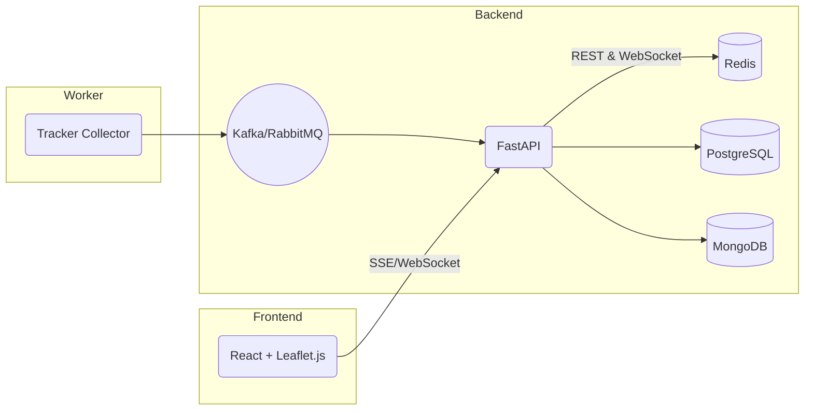

# 🚌 BusTracker

> **即時、開源、可擴充的公車位置查詢系統**

BusTracker 透過 **FastAPI**、**React + Leaflet.js** 與 **Docker Compose** 打造一站式的公車即時位置查詢服務。專案不僅適合政府或學術單位快速驗證原型，也方便開發者二次開發、客製功能或部署到雲端。

---

## ✨ 特色功能

| 類別 | 功能 | 說明 |
|------|------|------|
| 位置查詢 | 公車即時座標 | 以 WebSocket／SSE 持續推送最新經緯度 |
| 路線探索 | 附近站牌 & 路線 | 依照使用者所在位置推薦站牌與可搭乘路線 |
| 到站提醒 | 推播訂閱 | 提前 N 分鐘／公尺通知使用者公車即將到站 |
| 追蹤分析 | 地圖軌跡 | Leaflet 圖層動態描繪移動軌跡；可導出 GeoJSON |

---

## 🏗️ 技術架構



> - **PostgreSQL**：儲存靜態路線、站牌、行駛規劃。
> - **MongoDB**：寫入時間序列之車輛位置。
> - **Redis**：快取熱點資料，加速讀取。
> - **Kafka**：串流解耦，穩定收集外部定位資料。

完整圖見 `docs/architecture.png`。

---

## 🚀 快速開始

### 1. 先決條件

- Docker 20.10+
- Docker Compose v2

### 2. 取得原始碼並啟動

```bash
# Clone
$ git clone https://github.com/your‑org/openbustracker.git
$ cd bustracker

# 環境變數（可參考 .env.sample 自行調整）
$ cp .env.sample .env

# Build & Run
$ docker compose up -d --build
```

系統完成後：

| 服務            | URL                                   |
|-----------------|----------------------------------------|
| 前端            | <http://localhost:3000>                |
| Backend API     | <http://localhost:8000/api>            |
| API 文件 (Swagger) | <http://localhost:8000/docs>          |
| PgAdmin (選用)  | <http://localhost:5050>                |

### 3. 開發模式

```bash
# 後端 hot‑reload
$ docker compose exec backend uvicorn app.main:app --reload --host 0.0.0.0 --port 8000

# 前端 hot‑reload
$ npm --prefix frontend install && npm --prefix frontend run dev
```

### 4. 執行測試

```bash
$ docker compose exec backend pytest -q
```

---

## 📁 目錄結構

```
openbustracker/
├── backend/           # FastAPI 源碼
│   ├── app/
│   └── tests/
├── collector/         # 定位資料收集器 (Kafka Producer)
├── frontend/          # React + Vite + Leaflet.js
├── docs/              # 架構圖、API 說明
├── docker-compose.yml
└── README.md
```

---

## 📜 授權

本專案採用 **MIT License**，詳見 [LICENSE](LICENSE)。

---

## 🔗 參考資源

- [PTX 交通部運輸資料服務平台](https://ptx.transportdata.tw/)
- [FastAPI](https://fastapi.tiangolo.com/)
- [Leaflet.js](https://leafletjs.com/)
- [Awesome Transit Open Data](https://github.com/Transitland/awesome-transit)


